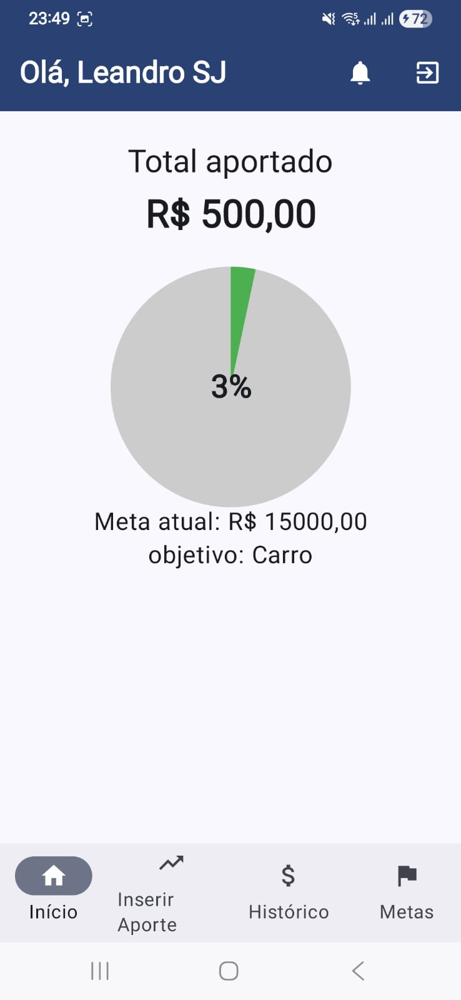
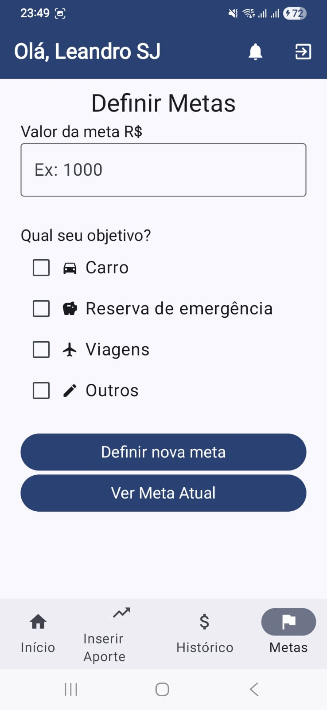

# investGames
Gerenciamento Bruto de aportes financeiros e investimentos com recompensas a cada aporte.

```Projeto pessoal para me ajudar a iniciar aportes financeiros com recompensas para que eu saia um pouco da rotina diária```

# 📷 Galeria de Imagens do Projeto

Bem-vindo! Aqui estão algumas imagens ilustrando o projeto:

## 🖼️ Tela Inicial


## 📊 Dashboard



## 🎯 Tela de Metas



---

### 📌 Como adicionar suas próprias imagens:

1. Coloque suas imagens na pasta `imagens/` (ou outra de sua escolha).
2. Use a seguinte sintaxe para exibir no Markdown:

```markdown


