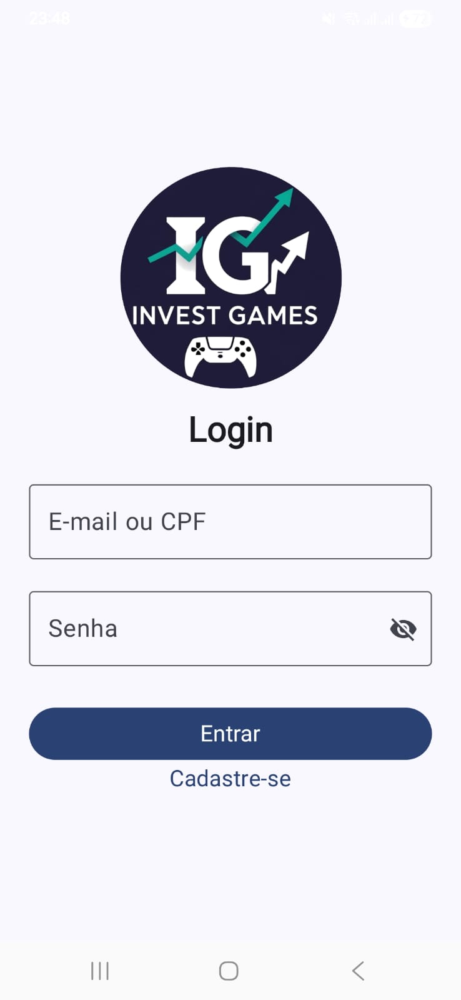
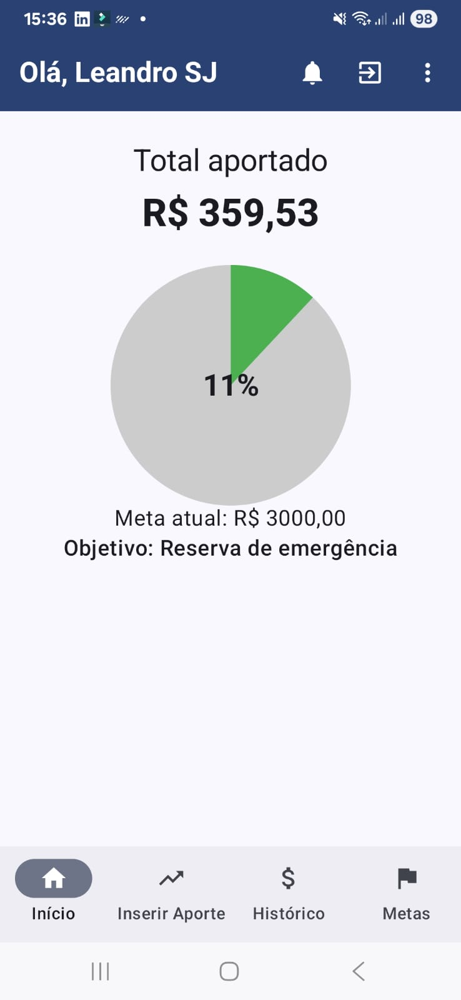
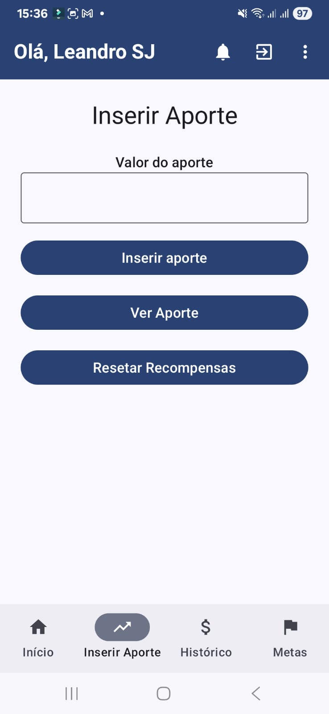
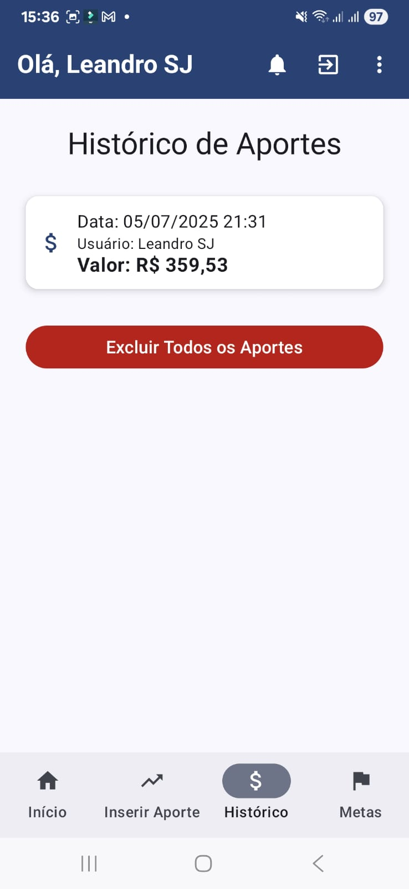
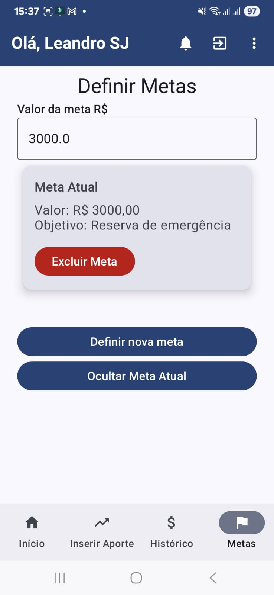
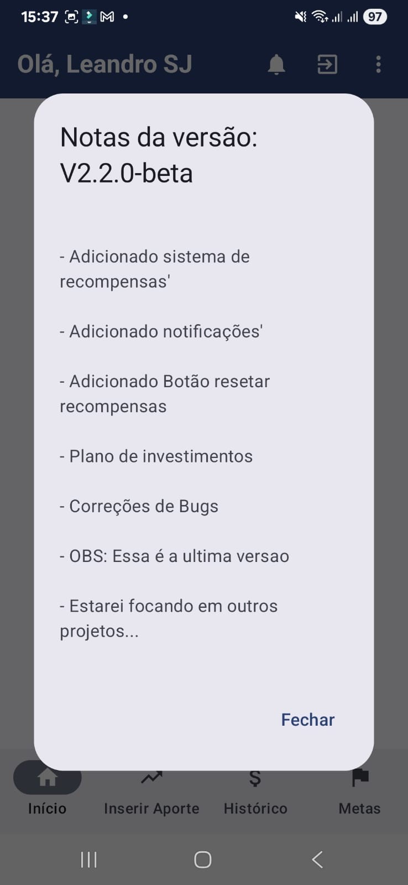
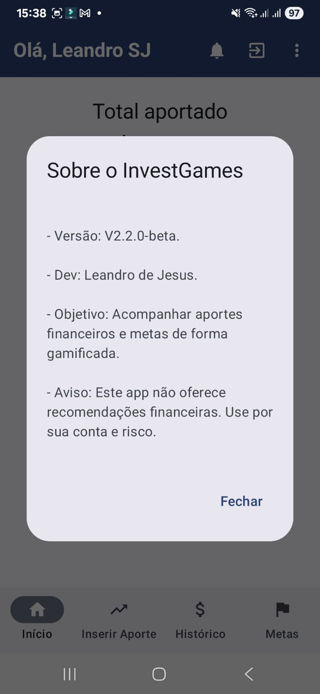

# 📈 InvestGames

**Aplicativo pessoal para organizar aportes e transformar o hábito de investir em algo mais leve e motivador.**

> Criei esse app com o objetivo de começar a investir com mais consistência. A ideia foi unir metas financeiras com um sistema de recompensas, tornando o processo mais divertido e menos mecânico.

---

##  O que o app faz?

- Ao registrar um aporte Permite acompanhar aportes financeiros que você fez em alguma instituição de forma simples  
- Mostra o total aportado e o progresso em relação à sua meta  
- Desbloqueia pequenas recompensas a cada passo dado  
- Exibe um histórico de aportes para acompanhar sua evolução  
- Oferece gráficos para visualização clara do progresso  
- Notifica mensalmente com mensagens motivacionais  
- Armazena tudo localmente, com segurança e privacidade  

---

## 📷 Galeria de Telas

Abaixo algumas imagens do projeto em funcionamento (os caminhos das imagens podem ser ajustados):

### Tela de Login

### Dashboard

### Inserir Aporte

### Histórico de Aportes

### Metas

### Notas da Versão

### ℹSobre o App

---

## Tecnologias e ferramentas usadas

- **Kotlin** com **Jetpack Compose**  
- Banco de dados local com **Room (SQLite)**  
- Navegação usando **Navigation Compose**  
- **ViewModel + LiveData**  
- Design inspirado no **Material 3**  
- Android Studio (versão Giraffe ou Koala)  

---

## 🔐 Login e segurança

- Login com CPF, e-mail e senha  
- Sessão salva de forma automática após o primeiro login, 

---

## 🎁 Recompensas e Metas

Você pode definir metas como:

- 🚗 Comprar um carro  
- 💰 Montar uma reserva de emergência  
- ✈️ Fazer uma viagem  
- 📦 Qualquer outro objetivo que quiser

A cada avanço, o app libera pop-up com pequenas recompensas como forma de reconhecimento pelo progresso.

---

## 👨‍💻 Sobre o projeto

Esse é um projeto pessoal, desenvolvido no tempo livre. A motivação principal foi criar algo útil pra mim mesmo, com intuito de me motivar a cada vez que eu conseguir inserir um novo aporte financeiro.
Não pretendo dar continuidade a este projeto visto que atingir o objetivo principal a qual eu mesmo havia proposto, e meu foco não é desenvolvimento android/mobile.

---

## 📄 Licença

Licenciado sob a **MIT License** – veja o arquivo [LICENSE](LICENSE) para mais detalhes.
